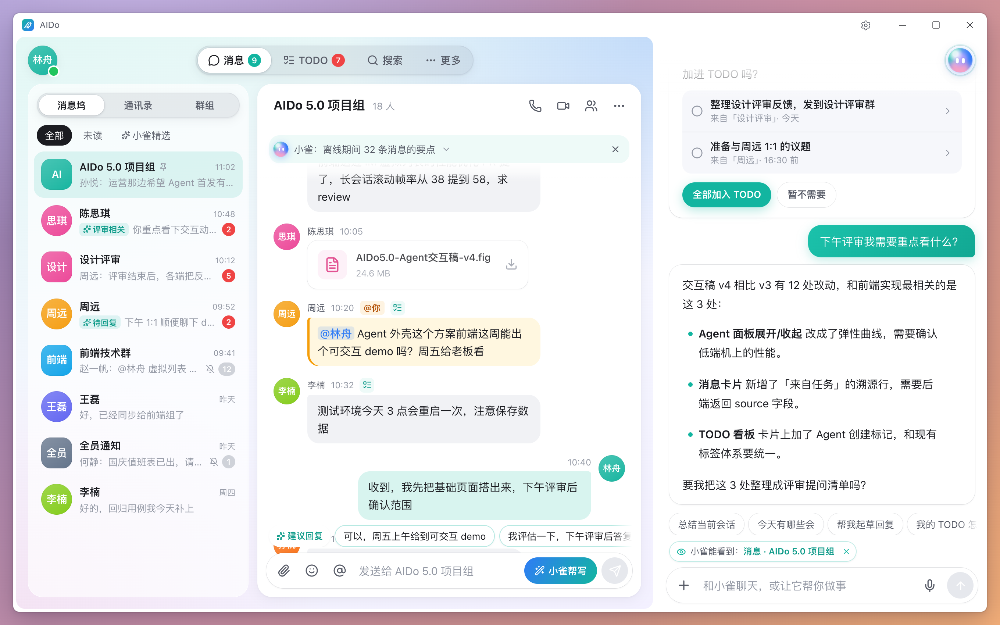
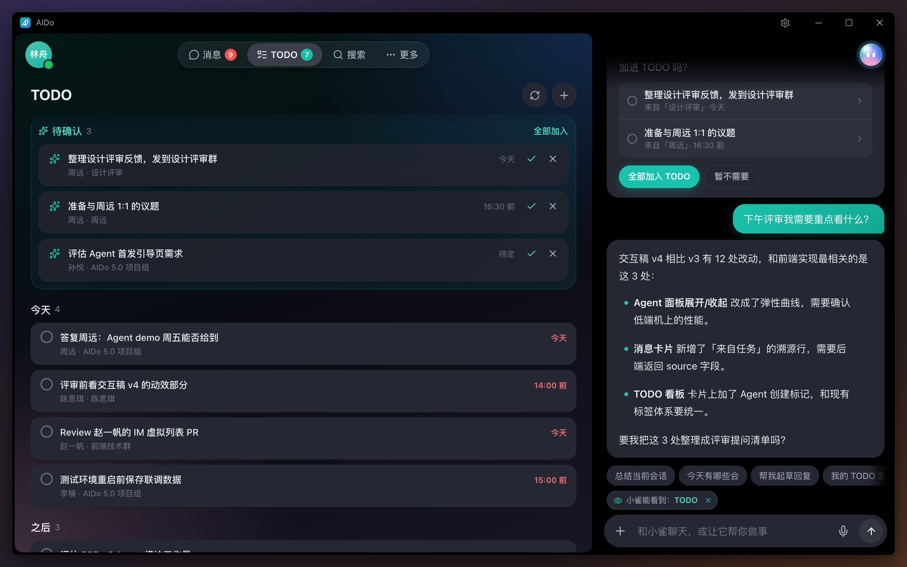
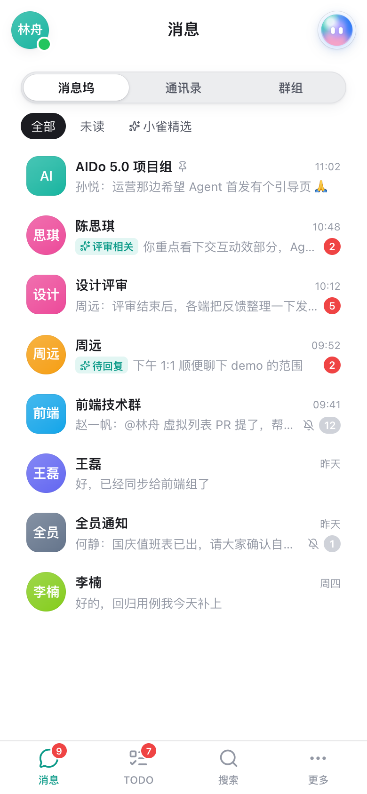
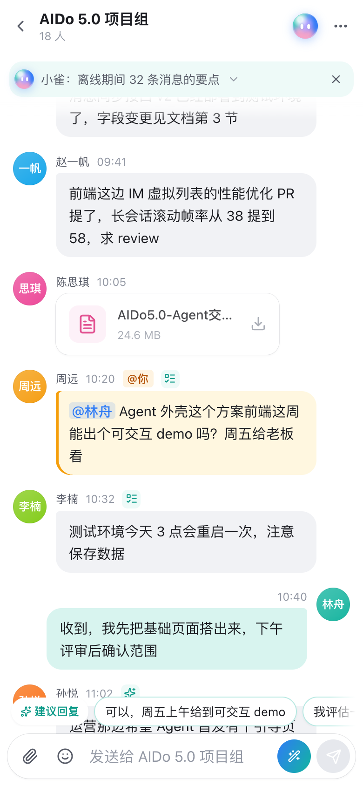
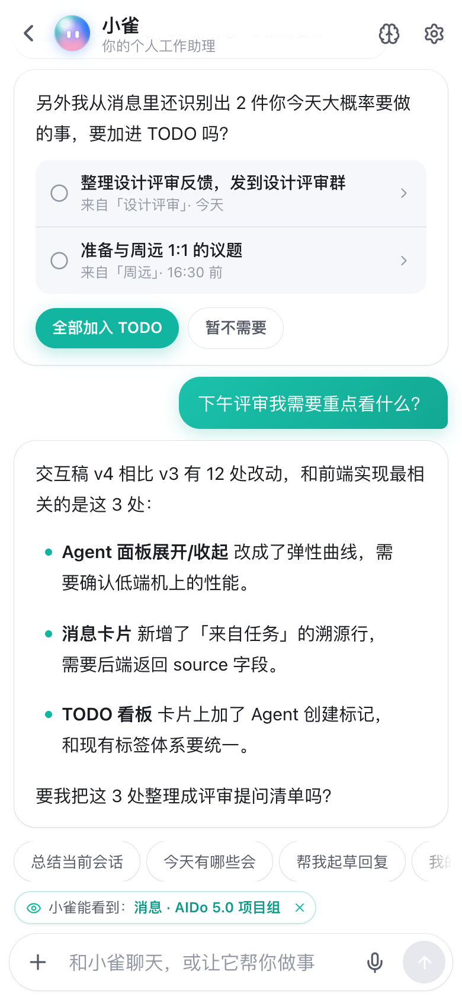

# AIDo 5.0

一个带个人 AI 助理「小雀」的工作 IM 原型：消息、TODO、记忆、搜索，以及随时陪在右侧的小雀面板。
前端 Vue 3，后端 Java 25 + Spring Boot 4 + PostgreSQL，WebSocket 实时推送，桌面和手机宽度都能用。

## 截图

**消息 + 小雀**：左边会话列表和聊天窗口，右边小雀按你正在看的会话回答



**TODO（深色模式）**：小雀从消息里整理出的待确认事项，今天 / 之后分组，每项都能追溯到原消息



**手机宽度**：底部导航的会话列表、全屏会话、全屏小雀面板

<p>
  
  
  
</p>

## 功能

- **消息**：私聊 / 群聊、未读、置顶与免打扰、@ 提及（输入 @ 选人，消息里高亮）、表情、附件（选文件 / 拖拽 / 粘贴截图，图片缩略图）
- **TODO**：小雀从消息里整理待办（可追溯到原消息），待确认 / 今天 / 之后 / 已完成，一键转为 TODO
- **小雀**：按主窗口正在看的内容回答，总结会话、起草回复（可直接发送并勾掉对应 TODO）、排 TODO、查日程；形象配色可换
- **记忆**：小雀记住的画像、具体记忆和学习来源，可修改
- **搜索**：联系人、群组、消息、文件、TODO 一处搜
- **实时**：新消息、已读、TODO、记忆、设置、资料变更通过 WebSocket 推送，多标签页同步，断线自动重连并补拉
- **账号**：登录 / 退出、修改密码、修改姓名和头像颜色
- **手机宽度**：底部导航、会话全屏、小雀全屏面板、设置底部抽屉

> 小雀目前是按关键词匹配的规则实现（`server/.../agent/RuleBasedAgentBrain`），接入大模型时实现 `AgentBrain` 接口替换即可。

## 技术栈

| | |
| --- | --- |
| 前端 | Vue 3 · Pinia · Vue Router · Vite · lucide 图标 |
| 后端 | Java 25 · Spring Boot 4.1（Spring MVC、虚拟线程）· Spring Security · Spring Session JDBC · WebSocket |
| 数据 | PostgreSQL 17 · Flyway 迁移 · `JdbcClient`（直接写 SQL） |
| 测试 | JUnit 5 · Testcontainers（真实 PostgreSQL），含 100 人并发推送压测 |

## 快速开始

需要 Node.js 20.19+ 或 22.12+、JDK 25、Maven、Docker。

```bash
# 1. 数据库（本机 55432 端口）
cd server && docker compose up -d

# 2. 后端（8080，首次启动自动建表并灌入演示数据）
mvn spring-boot:run

# 3. 前端（5173，/api 自动转发到后端）
cd .. && npm install && npm run dev
```

打开 http://localhost:5173 ，用演示账号登录（账号和初始密码见 [server/README.md](server/README.md#登录鉴权)）。

运行后端测试（需要 Docker）：

```bash
cd server && mvn test
```

## 目录结构

```
src/                前端
  api/              接口封装、实时推送连接
  stores/           Pinia：工作区、小雀、记忆、实时事件
  views/            消息、TODO、搜索、记忆、登录
  components/       小雀面板、聊天（表情 / @ / 消息文本）、TODO、通用组件
  layouts/          主框架（顶部 tab 栏、底部导航、小雀面板容器）
server/             后端，详见 server/README.md（接口、表结构、推送协议、鉴权）
```

## 说明

- 仓库里的数据库密码、演示账号密码只用于本地开发和演示；部署到正式环境时请通过环境变量覆盖（见 server/README.md 的「配置」），并关闭 `demo` profile。
- 附件默认存在 `server/data/files`，多实例部署时换成对象存储的实现。

## 许可证

见 [LICENSE](LICENSE)。
